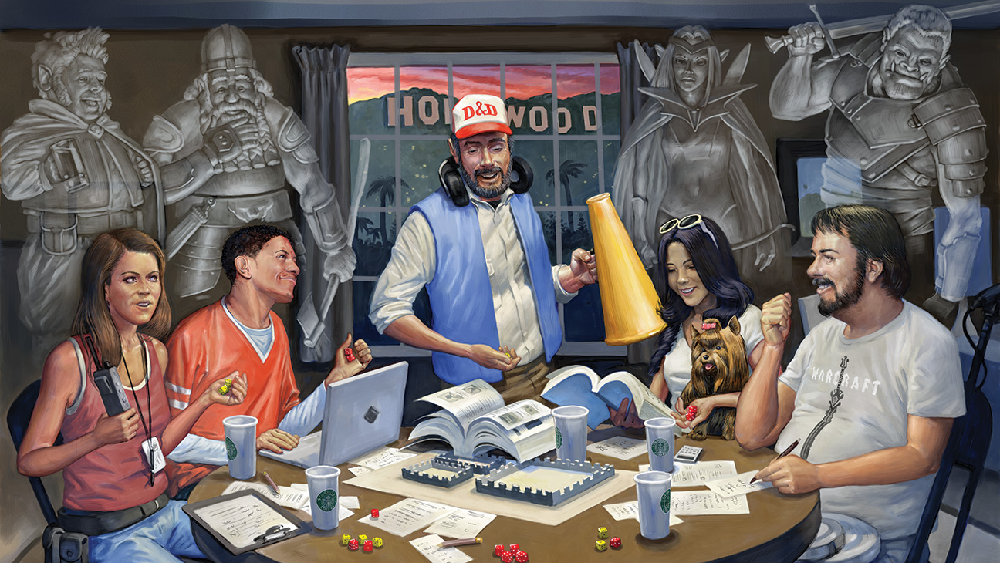
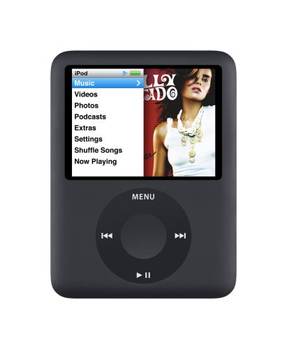
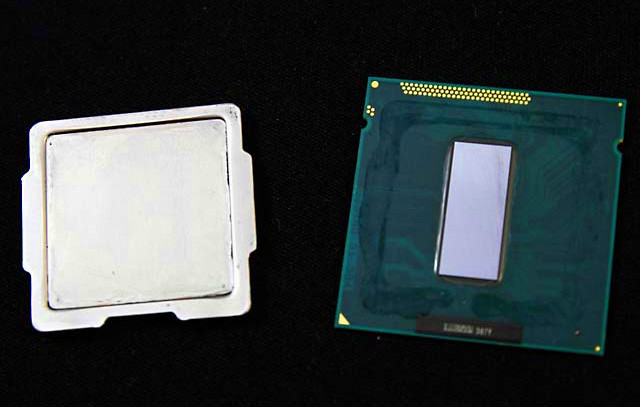
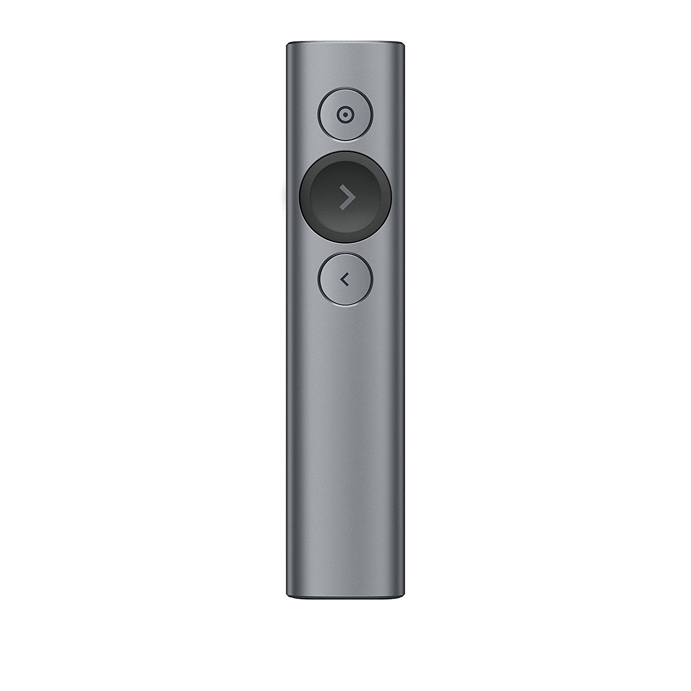
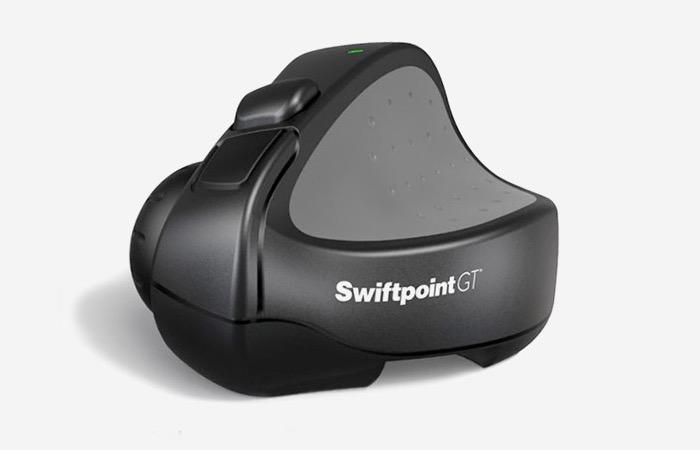
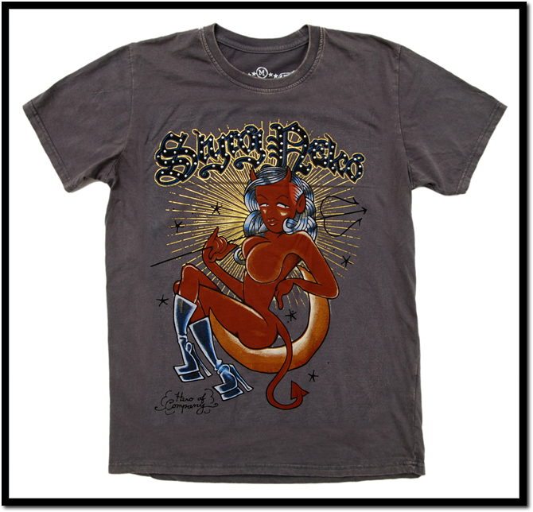
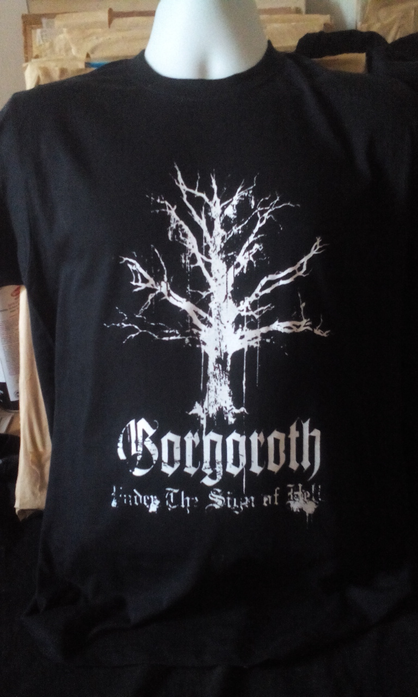
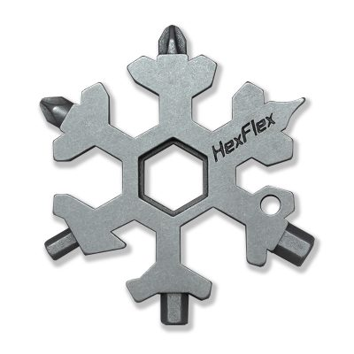
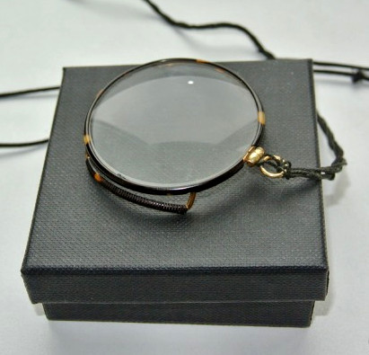

# A new TTRPG experience

A gaming session or a short (within five sessions) TTRPG campaign using any of the products from the list below.

  
<em>Click to unroll the list...</em></summary

1. [Ars Magica](http://www.atlas-games.com/arm5/)
2. [FFG SW: Edge of Empire](https://www.fantasyflightgames.com/en/products/star-wars-edge-of-the-empire/)
3. [Best Friends](https://www.drivethrurpg.com/product/20630/Best-Friends)
4. [FFG WH40k: Black Crusade](https://www.fantasyflightgames.com/en/products/Black-Crusade/)
5. [Torchbearer](https://www.torchbearerrpg.com/)
6. [Eclipse Phase](http://www.eclipsephase.com/)
7. [Red Markets](https://www.drivethrurpg.com/product/226794/Red-Markets-A-Game-of-Economic-Horror?src=also_purchased)
8. [HeroQuest](https://www.chaosium.com/heroquest/)
9. [Technoir](http://www.technoirrpg.com/)
10. [The company RPG](https://mega-corp.itch.io/the-company) и, в особенности [Project Ricochet](https://meatcastlegameware.itch.io/project-ricochet)
11. [PbTA tremulus](https://realityblurs.com/shop/product/tremulus-hardcover-print-pdf/)
12. [Mindjammer](https://mindjammerpress.com/mindjammer/)
13. [PbTA Monsters of the week](http://www.evilhat.com/home/monster-of-the-week/)
14. [Space Bounty Blues](https://nerdypapergames.itch.io/sbb)
15. [The Mountain Witch](https://sites.google.com/site/mountainwitchrpg/)
16. [Root RPG](https://www.magpiegames.com/category/root-rpg/)
17. [All flesh must be eaten](http://www.allflesh.com/flesh.html)
18. [Malifaux: Through The Breach](https://www.wyrd-games.net/through-the-breach/)
19. [Ultima Forsan: Макабрическая Русь](https://studio101.ru/savageworlds/ultimaforsan/ST5702)
20. [Bulldogs!](https://www.drivethrurpg.com/product/94493/Bulldogs-d20-Edition)
21. [S/Lay w/Me](http://adept-press.com/games-fantasy-horror/slay-wme/)
22. [Geiger Counter](http://www.jwalton.media/geiger)
23. [Misspent Youth](http://misspentyouth.robertbohl.com/)
24. [Contenders](https://www.drivethrurpg.com/product/20233/Contenders)
25. [The Sword, the Crown and the Unspeakable Power](https://www.drivethrurpg.com/product/239692/The-Sword-The-Crown-and-The-Unspeakable-Power))
26. [Night’s Black Agents](http://site.pelgranepress.com/index.php/nights-black-agents/)
27. [Conspiracy X](http://www.edenstudios.net/conspiracyx.html)
28. [Don't rest your head](http://www.evilhat.com/home/dont-rest-your-head-2/)
29. [The Whispering Vault](http://paizo.com/products/btpy7fk1?The-Whispering-Vault)
30. [OWoD Changeling: The Dreaming](http://www.drivethrurpg.com/browse/pub/1/White-Wolf/subcategory/1_14/Changeling-The-Dreaming)
31. [NWoD Changeling: The Lost](http://theonyxpath.com/category/worlds/chroniclesofdarkness/changelingthelost/)
32. [OWoD Wraith: the Oblivion](http://www.drivethrurpg.com/browse/pub/1/White-Wolf/subcategory/1_43/Wraith-The-Oblivion)
33. [Ten Candles](http://cavalrygames.com/ten-candles/)
34. [Murderous Ghosts](https://payhip.com/b/jGPB)
35. [Over The Edge](http://www.atlas-games.com/overtheedge/)
36. [Sorcerer](http://adept-press.com/games-fantasy-horror/sorcerer/)
37. [Ocean](http://www.drivethrurpg.com/product/63429/Ocean?manufacturers_id=385)
38. [Open Adventure](http://geekguild.com/openadventure/)
39. [The Quiet Year](https://buriedwithoutceremony.com/the-quiet-year/)
40. [The Shadow Theory](http://www.giantitp.com/forums/showthread.php?147142-Shadow-Theory-(d20-Modern-Horror))
41. [Каждый - Джон](http://archive.pnprpg.ru/layouts/EverythingIsJohn/John_RPG_example.pdf)
42. [44: A Game of Automatic Fear](https://www.drivethrurpg.com/product/79290/44-A-Game-of-Automatic-Fear)
43. [Savage Flower Kingdom](http://experimentalplayground.blogspot.ru/2013/08/savage-flower-kingdom.html)
44. [Dogs in the Vineyard](http://www.lumpley.com/dogs.html)
45. [Dresden files](https://www.evilhat.com/home/dresden-files-rpg/)
46. [Cryptomancer RPG](http://cryptorpg.com/)
47. [Esoteric Enterprises RPG](https://drive.google.com/file/d/1-TNP-a4JHBtS7iJUZD9Amt5RunIPA-yX/view?usp=sharing)
48. [English Eerie](https://www.drivethrurpg.com/product/225811/English-Eerie-Rural-Horror-Storytelling-Game-for-One-Player?src=also_purchased)
49. [City Planning Department](https://www.drivethrurpg.com/product/264075/City-Planning-Department?src=also_purchased)
50. [Dont Walk in Winter Wood](https://www.drivethrurpg.com/product/104196/Dont-Walk-in-Winter-Wood?manufacturers_id=584)
51. [Rust Hulks](https://www.drivethrurpg.com/product/300564/Rust-Hulks)
52. [Dark Ages: Fae](https://www.drivethrurpg.com/product/710/Dark-Ages-Fae)
53. [Degenesis](https://degenesis.com/)
54. [Shadow of The Demon Lord](https://schwalbentertainment.com/shadow-of-the-demon-lord/)
55. [Brindlewood Bay](https://www.gauntlet-rpg.com/brindlewood-bay.html)
56. [Mausritter](https://mausritter.com/)
57. [PbTA: Злодеяние](https://indigogames.ru/shop/zlodeyanie-pdf/)
58. [Cold City](https://www.indiepressrevolution.com/xcart/Cold-City-PDF.html)
59. [Let These Mermaids Touch Your Dick Maybe](https://riverhousegames.itch.io/let-these-mermaids-touch-your-dick-maybe)
60. [The Zone](https://laughingkaiju.com/games/the-zone/)
61. [Гусь-Хрустальный 2096](https://www.drivethrurpg.com/product/371634/-2096?manufacturers_id=19142)
62. [Three Sixteen](https://www.drivethrurpg.com/product/56768/Three-Sixteen)
63. [Alien RPG](https://www.alien-rpg.com/)
64. [Band of Blades](https://evilhat.com/product/band-of-blades/)
65. [Bliss Stage](https://www.drivethrurpg.com/product/194199/Bliss-Stage-Interim-Stage)
66. [Bootleggers](https://www.drivethrurpg.com/product/132208/Bootleggers)
67. [Breakers](https://johnharper.itch.io/breakers)
68. [Dogs in the Vineyard](https://en.wikipedia.org/wiki/Dogs_in_the_Vineyard)
69. [Dream Askew](https://www.drivethrurpg.com/product/261155/Dream-Askew---Dream-Apart)
70. [Electric Bastionland](https://chrismcdee.itch.io/electric-bastionland)
71. [Girl Underground](https://www.drivethrurpg.com/product/281656/Girl-Underground)
72. [Grey Ranks](https://www.drivethrurpg.com/product/86422/Grey-Ranks)
73. [Infected!](https://www.drivethrurpg.com/product/187452/Infected-Zombie-RPG)
74. [The King Is Dead](https://www.drivethrurpg.com/product/241598/The-King-Is-Dead)
75. [Lacuna Part I.](https://www.drivethrurpg.com/product/95893/Lacuna-Part-I-second-attempt)
76. [InSpectres](https://www.drivethrurpg.com/product/17891/InSpectres?src=hottest_filtered)
77. [Microscope](https://lamemage.itch.io/microscope)
78. [A Spark in Fate Core](https://www.drivethrurpg.com/product/117868/A-Spark-in-Fate-Core)
79. [Monmtsegur 1244](https://www.drivethrurpg.com/product/429235/Montsegur-1244)
80. [The World Wide Wrestrling RPG](https://ndpdesign.com/wwwrpg)
81. [The Mustang](http://www.onesevendesign.com/mustang/)
82. [Night Witches](https://bullypulpitgames.com/products/night-witches)
83. [Poison'd](https://www.nobleknight.com/P/2147389135/Poisond---A-Pirate-RPG)
84. [Under Hollow Hills](https://www.drivethrurpg.com/product/381079/Under-Hollow-Hills?manufacturers_id=3701)
85. [Polaris RPG](https://www.drivethrurpg.com/product/184944/POLARIS-RPG--Core-Rulebook-1--ENGLISH)
86. [PSI*RUN](https://lumpley.itch.io/psirun)
87. [Trollbabe](https://www.nobleknight.com/P/2147528017/Trollbabe)
88. [Tha Shab-al-Hiri Roach](https://bullypulpitgames.com/products/roach)
89. [The Shadow of Yesterday](https://mattmachell.github.io/minimum-viable-ebook/examples/tsoy/index.html)
90. [Shooting in Tha Moon](http://www.blackgreengames.com/shop/shooting-the-moon-pdf)
91. [Steal Away Jordan](https://www.indiepressrevolution.com/xcart/Steal-Away-Jordan-PDF.html)
92. [Swords Without Master](https://www.worldswithoutmaster.com/swords-without-master-about)
93. [Thou Art But A Warrior](https://www.drivethrurpg.com/product/142220/Thou-Art-But-A-Warrior)
94. [Cobwebs TTRPG]([url](https://worldchampgameco.itch.io/cobwebs))
95. [Sleepaway]([url](https://possumcreekgames.itch.io/sleepaway))
96. [The Electric State RPG](https://freeleaguepublishing.com/shop/the-electric-state-rpg/core-rulebook/)
97. [Slugblaster](https://slugblaster.com/)
98. [For The Queen](https://evilhat.com/product/for-the-queen/)
99. [The Veil](https://www.drivethrurpg.com/en/product/199467/the-veil-cyberpunk-roleplaying-powered-by-the-apocalypse)
100. [Belly of the beast](https://www.drivethrurpg.com/en/product/192736/belly-of-the-beast-rpg)

## Board Games also
1. [Exploding Kittens](https://www.explodingkittens.com/)
2. ~~[Cards Against Humanity](https://www.cardsagainsthumanity.com/)~~

# Gadgets and Other Tech

## KeyMouse Track 304

Or something similar, with at least one trackbal, scroll wheel and separate parts. The curving is not so required.
Anyway [here it is!](https://www.keymouse.com/catalog/keymouse/keymouse-track-125-3d-printed-assembled)

## Contour RollerMouse Mobile

[Available here](https://contourdesign.store/collections/all-products/products/rollermouse-mobile#details)

## Mini-popfilter by Samson

Available [on BigTV](https://www.bigtv.ru/product/pop-filtr-samson-ps05-621606/?event=gmerchant&roistat=merchant3_g_108475618259_online:ru:RU:621606&roistat_referrer=&roistat_pos=&utm_source=gmerchant&utm_medium=cpc&utm_campaign=10305589913&utm_content=621606&gclid=Cj0KCQjwse-DBhC7ARIsAI8YcWIAihDmeMTyLdZexeNIrJxdn-k5yvNxWTCtY0lKBEd2o3nOkKU-vT4aAn_aEALw_wcB)

## Xiaomi Mijia Wiha Electric 24-in-1 Screwdriver

Available [in many places](https://market.yandex.ru/offer/a7ZDCU1PUhpUyHhEFCe4fg?lr=194&cpa=0&onstock=1)

## Viozon Selfie Desktop Live Stand

Available [on Amazon](https://www.amazon.com/Viozon-Desktop-Microphone-competiable-Teaching/dp/B086W3L2XB/ref=as_li_ss_tl?ref_=ast_sto_dp&linkCode=sl1&tag=tecbri-20&linkId=0bde27c83a9f70ca1bc682f65f123908&language=en_US)

## 8Bitdo Wireless Bluetooth USB Adapter

For example, [from the official site](https://shop.8bitdo.com/products/8bitdo-wireless-bluetooth-adapter-for-nintendo-switch-windows-mac-raspberry-pi).

## Genovation CP48 USB Controlpad

Available [on Amazon](https://www.amazon.com/Genovation-CP48-USBHID-48KEY-CONTROLPAD-BLACK/dp/B00UH3E23G/ref=sr_1_4?dchild=1&keywords=Genovation&qid=1621025167&sr=8-4)

## Quick Keys Block by Xencelabs

Available [on the official site](https://www.xencelabs.com/store/accessories/xencelabs-quick-keys-remote)

## Elgato Stream Deck (Standard or XL)

Available [in many places](https://market.yandex.ru/search?text=Elgato%20stream%20deck&cvredirect=2&cpa=0&onstock=0&local-offers-first=0)

## AfterShokz OpenComm

Available [on the official site](https://us.aftershokz.com/products/opencomm) and [on Amazon](https://www.amazon.com/AfterShokz-Conduction-Noise-Canceling-Microphone-Commercial/dp/B08DW2SJCQ)

## Apple iPod Nano 3 Black

This vintage item. Can be used, in good condition.
- [For example, on Amazon](https://www.amazon.com/Apple-Generation-Black-Discontinued-Manufacturer/dp/B000JO3N3S/ref=sr_1_7?s=mp3&ie=UTF8&qid=1511646448&sr=1-7&keywords=ipod+nano+3+black)
- [For example, on eBay](https://www.ebay.com/sch/i.html?_odkw=apple+ipod+nano+3+black&_osacat=0&_from=R40&_trksid=p2045573.m570.l1313.TR0.TRC0.H0.Xapple+ipod+nano+3rd+black.TRS1&_nkw=apple+ipod+nano+3rd+black&_sacat=0)

## Central Processor for My Test Rig

New or used, in good condition.

#### LGA1150, Sandy Bridge, something from this list:
- Xeon E3-1220 v3, Xeon E3-1220L v3, Xeon E3-1225 v3, Xeon E3-1230 v3, Xeon E3-1235 v3, Xeon E3-1240 v3, Xeon E3-1245 v3, Xeon E3-1270 v3, Xeon E3-1275 v3, Xeon E3-1280 v3, Xeon E3-1290 v3;
- Core i7-2600, Core i7-2600K, Core i7-2600S, Core i7-2700K, Core i7-3770, i7-3770K, Core i7-3770S, Core i7-3770T

## Logitech Spotlight Advanced Presentation Remote

Remote control for presentations by Logitech.
[Available in many places](https://www.amazon.com/s/ref=nb_sb_noss?url=search-alias%3Daps&field-keywords=Logitech+Spotlight+Advanced+Presentation+Remote&rh=i%3Aaps%2Ck%3ALogitech+Spotlight+Advanced+Presentation+Remote)

## Pedals for PC

> "For those who use computers in alternative ways."©

Buy [here](http://www.kinesis-ergo.com/shop/savant-elite2-waterproof-triple-pedal/) or, as a last resort — [here](http://www.dx.com/p/usb-triple-action-foot-switch-keyboard-control-foot-pedal-56508#.VmFnZFjhDRY) or [here](https://www.elgato.com/us/en/p/stream-deck-pedal).

## Swiftpoint Mouse

[Buy here](https://www.swiftpoint.com/product/swiftpoint-gt-mouse-2/)

# Clothing and Accessories

## T-Shirts by Comrade Dmitry (XS/44)

[From here](https://sharkrobot.com/products/flick-the-bean?_pos=2&_sid=48ac710cb&_ss=r) and [from here](https://sharkrobot.com/products/comrade?_pos=1&_sid=efd74d7eb&_ss=r).

## "Cheap and Angry" T-Shirt (XS/44)

[For example, from here](https://hiphoptochka.com/YUG_Deshevo_y_Serdito_tee_ru)

## "Antisocial Media" T-Shirt (XS/44)

[Available on Bonfire](https://www.bonfire.com/one-million-dead-birdsites/)

## Any T-Shirt by Shiroi Neko  (XS/44)

More precisely, any [from this list](https://www.evernote.com/shard/s278/sh/7017da53-f9cd-4948-be86-2627fc7a4002/3af1e1f76b23666019606b7dce29068b)

## Gorgoroth "Under the Sign of Hell" Band T-Shirt (XS/44)

[Available on Amazon](https://www.amazon.com/Gorgoroth-Under-Sign-Hell-t-shirt/dp/B01H4LC5S2/ref=sr_1_43?ie=UTF8&qid=1487409843&sr=8-43&keywords=gorgoroth+tshirt)

## Merchandise from fcknzs.co.uk  (XS/44)

[Long Sleeve](https://fcknzs.co.uk/product/antifa-iron-front-3-arrows-3-4-sleeve-raglan-shirt) or [Sweatshirt](https://fcknzs.co.uk/product/antifa-iron-front-3-arrows-unisex-sweatshirt).

# DIY  

## Multitool-snowflake by HexFlex

[From here](https://www.hexflex.com/shop/?v=f24485ae434a)

# Misc

## Monocle

Can be on eBay, OLX and so on.
