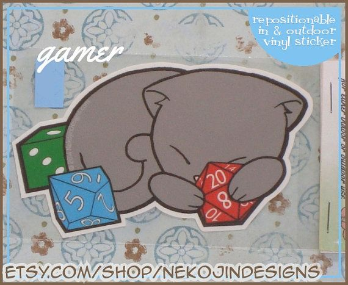
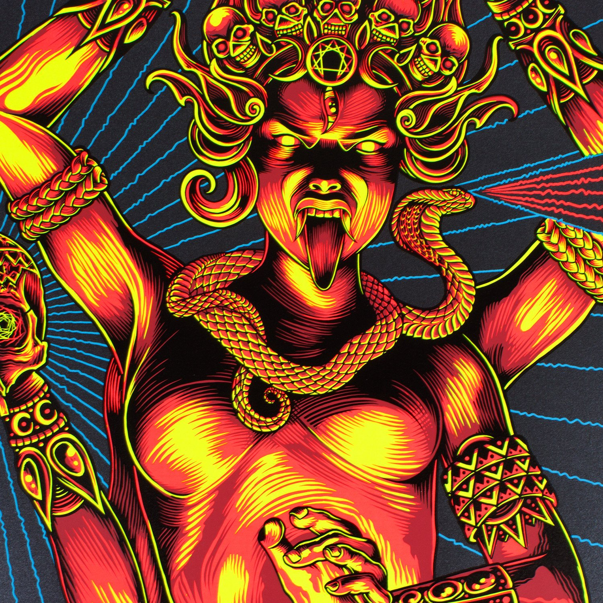
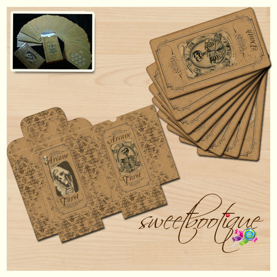
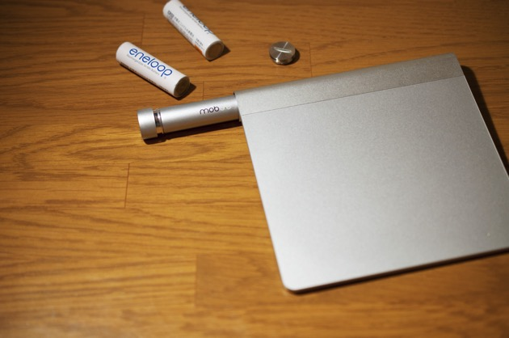
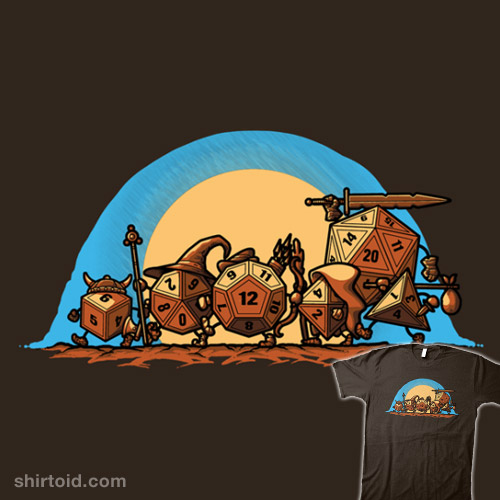
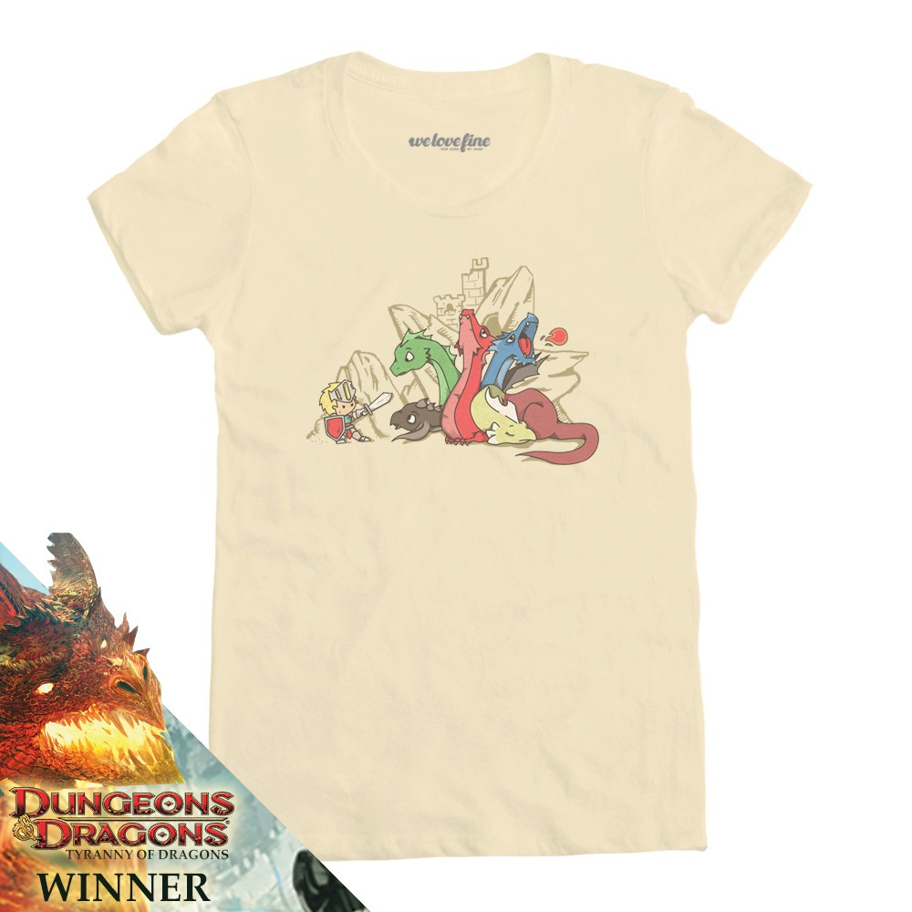
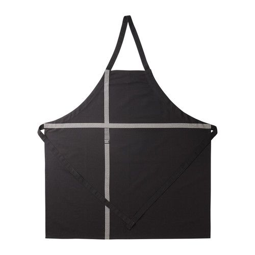

# Новый игровой опыт

Игровая встреча или короткая сюжетная кампания по любой системе правил для НРИ из списка:

1. [Ars Magica](http://www.atlas-games.com/arm5/)
2. [FFG SW: Edge of Empire](https://www.fantasyflightgames.com/en/products/star-wars-edge-of-the-empire/)
3. [FFG WH40k: Only War](https://www.fantasyflightgames.com/en/products/only-war/)
4. [FFG WH40k: Black Crusade](https://www.fantasyflightgames.com/en/products/Black-Crusade/)
5. [Weird Fantasy Role-Playing (LoTFP)](http://www.lotfp.com/RPG/)
6. [Torchbearer](https://www.torchbearerrpg.com/)
7. [Mouse Guard](http://www.mouseguard.net/)
8. [Eclipse Phase](http://www.eclipsephase.com/)
9. [The Black Hack](https://the-black-hack.jehaisleprintemps.net/)
10. [HeroQuest](https://www.chaosium.com/heroquest/)
11. [Technoir](http://www.technoirrpg.com/)
12. [Kult](http://kultdivinitylost.com/)
13. [PbTA tremulus](https://realityblurs.com/shop/product/tremulus-hardcover-print-pdf/)
14. [PbTA Monsterhearts](https://buriedwithoutceremony.com/monsterhearts/)
15. [PbTA Городские легенды](https://studio101.ru/ST1001)
16. [PbTA Monsters of the week](http://www.evilhat.com/home/monster-of-the-week/)
17. [Lady Blackbird](http://www.onesevendesign.com/ladyblackbird/)
18. [The Mountain Witch](https://sites.google.com/site/mountainwitchrpg/)
19. [Blades in the dark](http://www.evilhat.com/home/blades-in-the-dark/)
20. [All flesh must be eaten](http://www.allflesh.com/flesh.html)
21. [Malifaux: Through The Breach](https://www.wyrd-games.net/through-the-breach/)
22. [Ultima Forsan: Макабрическая Русь](https://studio101.ru/savageworlds/ultimaforsan/ST5702)
23. [Hot guys making out](http://lavikandia.ru/sites/default/files/books/lgp.pdf)
24. [S/Lay w/Me](http://adept-press.com/games-fantasy-horror/slay-wme/)
25. [Delta Green](http://www.delta-green.com/)
26. [Misspent Youth](http://misspentyouth.robertbohl.com/)
27. [Driftwood Verses](https://www.kickstarter.com/projects/464014331/the-driftwood-verses)
28. [Mutant: Year Zero](http://www.modiphius.com/mutant.html)
29. [Night’s Black Agents](http://site.pelgranepress.com/index.php/nights-black-agents/)
30. [Conspiracy X](http://www.edenstudios.net/conspiracyx.html)
31. [Don't rest your head](http://www.evilhat.com/home/dont-rest-your-head-2/)
32. [The Whispering Vault](http://paizo.com/products/btpy7fk1?The-Whispering-Vault)
33. [OWoD Changeling: The Dreaming](http://www.drivethrurpg.com/browse/pub/1/White-Wolf/subcategory/1_14/Changeling-The-Dreaming)
34. [NWoD Changeling: The Lost](http://theonyxpath.com/category/worlds/chroniclesofdarkness/changelingthelost/)
35. [OWoD Wraith: the Oblivion](http://www.drivethrurpg.com/browse/pub/1/White-Wolf/subcategory/1_43/Wraith-The-Oblivion)
36. [Ten Candles](http://cavalrygames.com/ten-candles/)
37. [Murderous Ghosts](https://payhip.com/b/jGPB)
38. [Over The Edge](http://www.atlas-games.com/overtheedge/)
39. [Sorcerer](http://adept-press.com/games-fantasy-horror/sorcerer/)
40. [Ocean](http://www.drivethrurpg.com/product/63429/Ocean?manufacturers_id=385)
41. [Open Adventure](http://geekguild.com/openadventure/)
42. [The Quiet Year](https://buriedwithoutceremony.com/the-quiet-year/)
43. [The Shadow Theory](http://www.giantitp.com/forums/showthread.php?147142-Shadow-Theory-(d20-Modern-Horror))
44. [Каждый -- Джон](http://archive.pnprpg.ru/layouts/EverythingIsJohn/John_RPG_example.pdf)
45. [Savage Flower Kingdom](http://experimentalplayground.blogspot.ru/2013/08/savage-flower-kingdom.html)
46. [Dogs in the Vineyard](http://www.lumpley.com/dogs.html)
47. [Dresden files](https://www.evilhat.com/home/dresden-files-rpg/)

# Декор

## Всеразличные настольно-ролевые наклейки

Не обязательно на русском. Не брендированные. Забавные.

[Например, с Redbubble](https://www.redbubble.com/shop/dnd+stickers?cat_context=u-stationery&page=1&accordion=product)

- [Ещё есть на Zazzle.com](https://www.redbubble.com/shop/stickers+tabletop+rpg?cat_context=u-stationery&page=1&accordion=product)

## Календарик от ArtSCP

[Вот отсюда](http://artscp.com/calendar)

## Постер "Through the gateway" от Palehorse

[Вот отсюда](https://palehorse.myshopify.com/collections/prints/products/through-the-gateway-print)

## Постер от "Manalanextdoor"

[Вот отсюда](http://manalanextdoor.com/shop/manala-poster)

# Инвентарь для НРИ

## Plano storage box model 737  

[Купить, например, тут](http://www.voblera.net/catalog/yaschiki/plano-737-001)

## Или Flambeau 8010 FRONT LOADER  

## Crystal Caste Mini BattleTop

Вот такой вот спец. столик. Можно два.

[Есть на eBay](http://www.ebay.com/sch/i.html?_odkw=Crystal+Caste+Mini+Battletop-&_osacat=0&_from=R40&_trksid=p2045573.m570.l1313.TR0.TRC0.H0.XCrystal+Caste+Mini+Battletop.TRS0&_nkw=Crystal+Caste+Mini+Battletop&_sacat=0)

## Stack the Bones game от Kickerland

[Купить, например, тут](http://www.ebay.com/sch/i.html?_from=R40&_sacat=0&_nkw=Stack+the+Bones+Game&_sop=15)

## D&D-совместимые миниатюрки Всякие (но лучше - крашеные), можно даже Б/У  

## Антуражно-винтажную монохромную колоду таро

В качестве оракулов и генератора случайностей.  
[Есть на Etsy](https://www.etsy.com/ru/listing/166592386/gothic-tarot-deck-78-cards?ref=market)

## Настолка "Космическая тревога"

Для эффективной симуляции <s>*полной опы*</s> критической ситуации в условиях открытого космоса.  
[Брать здесь](http://www.eburg.mosigra.ru/Face/Show/space_alert/)

## Настолка "Шакал: Подземелье"

Исключительно ради карточек.

Есть [в Мосигре](http://www.mosigra.ru/Face/Show/Jackal_podzemelie/).

# Гаджеты и прочая техника  

## Внешний аккумулятор для мобильных устройств

[Например, HIPER MP15000](https://market.yandex.ru/product/10776475/offers?hid=8353924&track=srchbtn&local-offers-first=1&deliveryincluded=0)

## Logitech Spotlight Advanced Presentation Remote

Дистанционный пульт для презентаций от Logitech.

[Есть много где.](https://www.amazon.com/s/ref=nb_sb_noss?url=search-alias%3Daps&field-keywords=Logitech+Spotlight+Advanced+Presentation+Remote&rh=i%3Aaps%2Ck%3ALogitech+Spotlight+Advanced+Presentation+Remote)

## The Ergonimic Touchpad

Небольшой гибкий тачпэд в дополнение к моим странным клавиатурам.

[Покупать у производителя](http://www.ergonomictouchpad.com/ergonomic_touchpad.php)

## mStand360 for laptop

[Например на Amazon](https://www.amazon.com/Rain-Design-10032-mStand-Laptop/dp/B000OOYECC/ref=nosim&tag=sweetsetup-20).

## Mobee Technology Power Bar

Доступен [здесь](https://www.amazon.com/Mobee-Technology-Power-Bar-Rechargable/dp/B006W5FIJK/ref=sr_1_1?ie=UTF8).

## Педали для ПК

> "For those who use computer in alternative ways."©

Брать [здесь](http://www.kinesis-ergo.com/shop/savant-elite2-waterproof-triple-pedal/) или, на худой конец — [здесь](http://www.dx.com/p/usb-triple-action-foot-switch-keyboard-control-foot-pedal-56508#.VmFnZFjhDRY).

## Убермышь "Swiftpoint GT"

Реально крутая и чертовски удобная для меня мышь.  
[Купить тут](https://www.swiftpoint.com/product/swiftpoint-gt-mouse-2/)

## Аудио-гарнитуру, беспроводную, USB, с закрытыми наушниками  

Например — Creative Sound Blaster Tactic 3D Wrath  
[Купить тут](http://market.yandex.ru/model.xml?modelid=7808503&hid=6368403&text=Creative%20Sound%20Blaster%20Tactic%203D%20Wrath&srnum=2)  

##  Стереоколонки  

Например, «Microlab Pro 1» или «Microlab Pro 2»  
[Купить тут](http://market.yandex.ru/search.xml?text=microlab+pro&cvredirect=2)  

### Huawei E5756

Или аналогичный универсальный 3G-роутер.

[Посмотреть на Yandex.Market](https://market.yandex.ru/product/9263633?hid=723087&track=tabs)

## Wacom Intuos Personalisation Kit

[Купить тут](http://cvp.com/index.php?t=product/wacom_wacack40801)

## Триммер для усов и бороды

Какой-нибудь небольшой и аккуратный.
Например – [Braun CruZer 6 Precision](http://ekb.onlinetrade.ru/catalogue/trimmer_dlya_litsa_i_tela-c1326/braun/trimmer_dlya_borodi_i_usov_braun_cruzer_6_precision-133061.html?from=yamekb&utm_source=yamarket&utm_medium=cpc&_openstat=bWFya2V0LnlhbmRleC5ydTvQotGA0LjQvNC80LXRgCDQtNC70Y8g0LHQvtGA0L7QtNGLINC4INGD0YHQvtCyIEJSQVVOIENydVplciA2IFByZWNpc2lvbjszbW96YzBqRkNSTXYyTDhmRTZWU1BnOw)

### Не гаджеты, но тем не менее

#### Подарочные карты App Store. Всегда актуально (я ведь покупаю софт и всё такое).

#### Что угодно из моего "wishlist" на Steam.

[Смотреть wishlist здесь](https://steamcommunity.com/id/anmcarrow/wishlist/)

# Карторисовательное

## Мега-набор линеров от Stabilo

[Можно купить в Комус](https://www.komus.ru/katalog/pismennye-prinadlezhnosti/linery/nabor-linerov-stabilo-point-8820-02-tolshhina-linii-0-4-mm-20-tsvetov-/p/105985/)

## Портативный световой стол A3-формата

Для рисования руками по бумаге всяких многослойных конструкций.  
[Например, вот этот](http://www.amazon.co.uk/MiniSun-Modern-Ultra-Slim-Design-LightPad/dp/B00AYXR7CW/ref=sr_1_1?s=lighting&ie=UTF8&qid=1433242974&sr=1-1&keywords=MiniSun+A3+LED)

## Настольную микрофонную стойку

[Например – такую](http://konsonans-ekb.ru/shop/stoyki_mikrofonnye/stoyka_mikrofonnaya_force_msc_10/)  

# Одежда и аксессуары  

## Пафосную рабочую робу «хозяина подземелья»

Из естественных материалов, тёмно-серую или тёмно-красную (бордо), отороченную золотой тесьмой, с глубоким капюшоном, запахивающуюся,  на мальчика с размером торса 44 и ростом 170. Наличие подкладки опционально, но желательно.

Зачем? <s>Во славу...!</s> Например, [чтобы делать так](http://www.kingofrpgs.com/the-street-master-2/).

# Футболки
<small>**Примечание:** Все нижеперечисленные футболки также вполне актуальны в виде «longsleeve» (с длинным рукавом), если такая опция вообще доступна на сайте магазина.</small>

## Футболку с тонкими аллюзиями...

...а точнее — вот с такой картинкой.

[Есть, например, вот здесь](https://printio.ru/tees/150714)

## Футболку «Fellowship of the dungeon», мужскую, размер «S»

[Купить тут](http://shirt.woot.com/offers/fellowship-of-the-dungeon?utm_campaign=Commission+Junction+-+10836837&utm_source=Commission+Junction+Publisher+-+3497954&utm_medium=affiliate+-+shirt.woot)

## Футболку «Me and Ms.Tiamat», мужскую, бежевого цвета, размер «S»

[Купить тут](https://www.amazon.com/Dungeons-Dragons-Mens-T-Shirt-Tiamat/dp/B01MTIRDXF?th=1&psc=1)

## Футболку «Dragon of few words», мужскую, серого цвета, размер «S»

[Купить тут](http://www.welovefine.com/t-shirts-425-434/dragon-of-few-words-10325/sort/p.sort_order.html?order=DESC)

## Футболку «Cubicles & Coworkers», мужскую, серого цвета, размер «S»

[Купить тут](http://shirt.woot.com/offers/cubicles-and-coworkers?ref=cnt_ctlg_dgn_2)

## Любую футболку от Shiroi Neko, мужскую, размера «S»

Точнее, любую [из этого  списка](https://www.evernote.com/shard/s278/sh/7017da53-f9cd-4948-be86-2627fc7a4002/3af1e1f76b23666019606b7dce29068b)  

## Мерчевую футболку группы Gorgoroth, мужскую, размера «S»

[Есть на Amazon](https://www.amazon.com/Gorgoroth-Under-Sign-Hell-t-shirt/dp/B01H4LC5S2/ref=sr_1_43?ie=UTF8&qid=1487409843&sr=8-43&keywords=gorgoroth+tshirt)

## Множество отличных футболок с Zazzle.com

- <https://www.zazzle.com/kali_t_shirt-235854008983640786>
- <https://www.zazzle.com/miskatonic_university_t_shirt-235430999754366098>
- <https://www.zazzle.com/cthulhu_caution_t_shirt-235279601253633822>
- <https://www.zazzle.com/postmodern_summoning_t_shirt-235066430517886001>
- <https://www.zazzle.com/cthulhu_t_shirt-235622896783733667>
- <https://www.zazzle.com/mythos_elder_thing_old_one_t_shirt-235357922211266197>
- <https://www.zazzle.com/necronomicon_bleached_talk_t_shirt-235202178165633197>
- <https://www.zazzle.com/necronomicon_bleached_cream_white_t_shirt-235912579871673448>
- <https://www.zazzle.com/miskatonic_university_antarctic_expedition_t_shirt-235409043430069889>
- <https://www.zazzle.com/rebis_t_shirt-235996081230660655>
- <https://www.zazzle.com/hekate_dark_t_shirt-235987445013351217>
- <https://www.zazzle.com/outlandish_esoteric_t_shirt-235590697409030175>
- <https://www.zazzle.com/esoteric_order_of_dagon_symbol_t_shirt-235945264151439389>
- <https://www.zazzle.com/relalize_real_lies_t_shirt-235496062662316468>
- <https://www.zazzle.com/have_you_found_the_yellow_sign_symbol_on_back_t_shirt-235025547363056946>
- <https://www.zazzle.com/game_master_power_corrupts_t_shirt-235406111502626734>
- <https://www.zazzle.com/game_masters_do_it_on_the_table_t_shirt-235819707247425341>
- <https://www.zazzle.com/real_gamers_white_t_shirt-235587120282723336>
- <https://www.zazzle.com/occasional_evil_t_shirt-235598518120508269>
- <https://www.zazzle.com/osr_dark_edition_t_shirt-235056116775382095>
- <https://www.zazzle.com/isometric_osr_t_shirt-235653562529271801>

# Кухня  

## Термокружка Starbucks Stainless Steel Tumbler

Матовый, чёрный, модели «Stealth» (на фото)  

[Купить тут](http://goo.gl/V0uUMi)

## Кухонный таймер в виде помидора

Можно [заказать у китайцев](http://ru.aliexpress.com/wholesale?catId=0&initiative_id=SB_20160621232952&SearchText=pomodoro+timer)

## Фартук

[IKEA Гунстиг из серии "365+"](http://www.ikea.com/ru/ru/catalog/products/60182115/)  

# DIY  

## Leatherman Surge Multitool (black)

Просто хороший мультитул.

[Есть на Amazon.](https://www.amazon.com/dp/B00WL3MS0O/_encoding=UTF8?coliid=I2L3FXQ4DGUPV3&colid=3D5OKPNL4HSFZ)

## Пила ручная, складная-садовая

[Fiskars Xtract™ SW75](http://market.yandex.ru/search.xml?hid=90666&text=fiskars%20sw75&srnum=3&ortext=fiskars%20sw75)  
Для походов в леса – самое оно.

## Паяльная станция с феном

[Например, такую](http://siriust.ru/oborudovanie/payalnoe-oborudovanie/payalnye-stancii/stanciya-payalnaya-wep-852/)

## Мультитул от HexFlex

[Покупать здесь](https://www.hexflex.com/shop/?v=f24485ae434a)

## Набор для заточки инструмента от Lansky

[Суперская штука](http://www.sld.ru/catalog/nozhi/prisposobleniya-dlya-zatochki/nabor-dlya-zatochki-lansky-lkc03-standard.html)

# Прочее

## Велосипедное седло Brooks Flyer

Да, оно недешёвое и на любителя.
Но тем не менее.

## Жёлтого резинового утёнка

Или двух (пригодятся [для отладки кода](https://ru.wikipedia.org/wiki/%D0%9C%D0%B5%D1%82%D0%BE%D0%B4_%D1%83%D1%82%D1%91%D0%BD%D0%BA%D0%B0)).
Или не жёлтого [а какого-нибудь ещё](https://catchy.io/slides/img/debugging/rubber-duck-killed.jpg).

## Подарочные сертификаты в какой-нибудь екатеринбуржский Tattoo-салон

Желательно тот, в котором хорошо умеют работать с [blackwork](http://www.furfur.me/furfur/all/culture/164137-blackwork) по эскизам заказчика.

## Сертификаты-билеты на IT-курсы

Особенно, если они связаны с Unix/Linux и сетями.

## Сертификаты на языковые курсы (английского языка)

Онлайн или локально в Екатеринбурге.

## Сертификаты на курсы по изучению традиционных ремёсел

Лепка, керамика, плетение из лозы/бересты, плотницкие работы, вот это всё.

## Банджо (и колечки к нему)

Cерьёзно, чав, банджо это супер.
